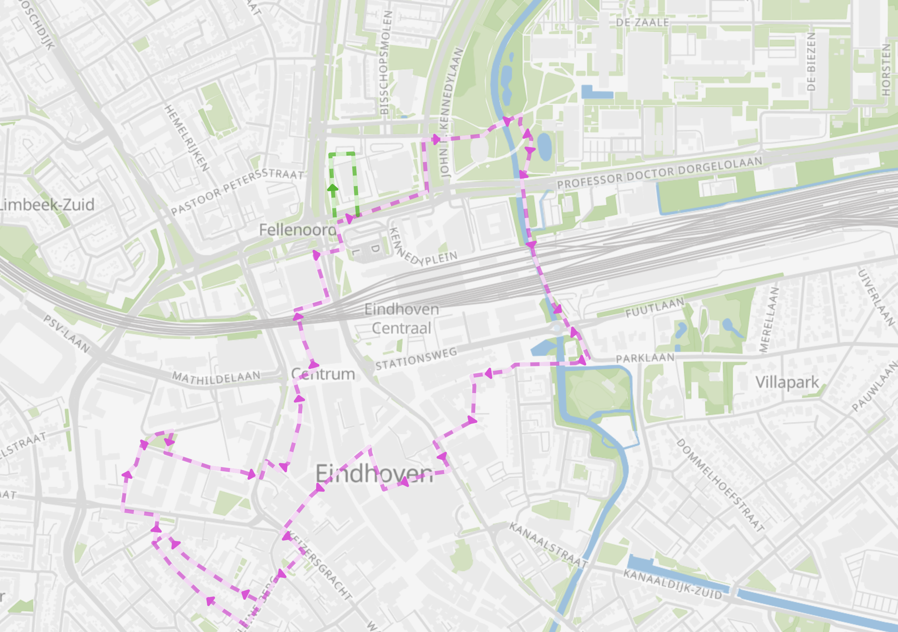

# Eindhoven

Eindhoven 是荷蘭南部的一個工業城鎮。這個城之所以會發家，Philips這家公司的貢獻是無可厚非。這棵大樹開枝散葉，讓這個城鎮在其庇蔭下成長茁壯。有很多世界規模的公司在這邊吸取當地的人文與研發養分，展示對技術與科技的熱枕。

> 有名的公司有Signify, NXP, DAF, ASML...等等。 

一開始，Philips有很大的業務群是座城市的燈光系統，搭上了世界各地開發高速公路的風潮，他們為高速公路的照明提供了系統性的服務。（後來光照系統的業務群分出去變成另一間公司，即是Signify）
這就是他們賦予glow這個科技藝術祭的故事意義。 
我因為興趣，辭了工作之後，到Techinische Universiteit Eindhoven (TU/e)念研究所，進而知道了這個特殊的藝術祭。

我一直覺得，自Philips時代開始，他們就著迷於科技與藝術之間的橋樑。以前我小時候也算是個發燒聽友，很多音樂CD的錄製要是壓上Philips 這個logo, 就是對錄製音樂的工程是個品質的保證。另一方面，我也很認同科學本身是存在一定的美感。誰說掛在牆壁上的才有美感呢？ 
基於這樣的背景，Eindhoven glow （燈光節）的意義，除了藝術的美之外，有很大一部分，他們希望能搭起科學與美術之間的橋樑。
# Glow
- Glow 官方網站: google 搜尋glow eindhoven 就會跳出當年度的官網與時間。
- Glow 於每年１１月舉辦，是冷天氣，且Netherlands很會下雨，要記得雨具與保暖措施。
- 展覽有室外也有室內，展點之間必定會需要走一段路。
- 展覽開始時間都會是在晚上，大概18:00開始。（這樣才夠暗） 
通常，glow 的季節都落在11月，地點則以Eindhoven火車站為中心，展點四落在Eindhoven各個角落。要是一天逛完每個展區也可以，端看當年度的規模。
例如，２０２４年的展間路線如下：

> 我記得有一年的路線延著河道延展到城的東邊。

## 之前的展品
經過幾年觀察之後，我發現作品分幾種：
1. 靜態投影作品：就是漂亮的影像打在建築物上，有時會跟建築物的外皮有影像上的呼應
2. 動態投影作品：通常搭配音樂與動態影像。2022年之後，甚至有generative model 產生的影像，這個部分就挺有趣的。

這個影像是直接把看展人當下手繪的圖片投影到影像上，同時，用ML model自動上色與渲染人們的手繪圖案。

這個是將整個工廠都進行投影，很有趣的是，人群看到這個畫面之後，很自動的會跟環境互動，我喜歡在角落觀察那些人的互動。

展場也可以讓寵物進場唷！歐洲有個優點是，他們把寵物視為家人而非家畜。他們對人類的社交行為已經進步到另一個層面了。

3. 裝置藝術作品：通常在空曠的地點，作品有很多巧思。
很多這類作品會放在TU/e的校園內。只是當時要是遇到考試週，應該會看到很多行屍走肉的學生。

4. 互動裝置藝術作品：這種會有一段時間的表演區間，有時會跟人的動作有互動效果，通常是學生的嘔心瀝血之作，但也常常是最快壞掉的（哈）。我的影片有這類作品的片段。

# Conclusion
這個光影節把科學與藝術做結合，利用光影與科技進行結合，致力於表達他們對於日常生活，或是自己的想法。而非去迎合一個活動，他們更多是將舞台提供給有想法的人，當然，對於表演與展示的部分有官方的要求。這樣的活動雖然很好，但是規模有限。希望這個藝術祭之後越來越茁壯。 
當年看到一個負責一項作品的學生跟自己的作品跳舞，那種單純的快樂在他的臉上，讓我感到羨慕。要是對他們的作品好奇的話，他們會像狗狗一樣很熱枕的回答所有問題。也許當地人士受到這種熱情影響，所以每年都很積極地參加這個活動。
<!-- <iframe src="//www.youtube.com/embed/3zP4oZR3gls?si=jXtuxe4rQNUnM6TM" frameborder="0" allowfullscreen=""></iframe> -->
<iframe width="560" height="315" src="https://www.youtube.com/embed/3zP4oZR3gls?si=jXtuxe4rQNUnM6TM" title="YouTube video player" frameborder="0" allow="accelerometer; autoplay; clipboard-write; encrypted-media; gyroscope; picture-in-picture; web-share" referrerpolicy="strict-origin-when-cross-origin" allowfullscreen></iframe>
<!-- <iframe width="560" height="315" src="https://www.youtube.com/embed/3zP4oZR3gls?si=jXtuxe4rQNUnM6TM" title="YouTube video player" frameborder="0" allow="accelerometer; autoplay; clipboard-write; encrypted-media; gyroscope; picture-in-picture; web-share" referrerpolicy="strict-origin-when-cross-origin" allowfullscreen></iframe> -->